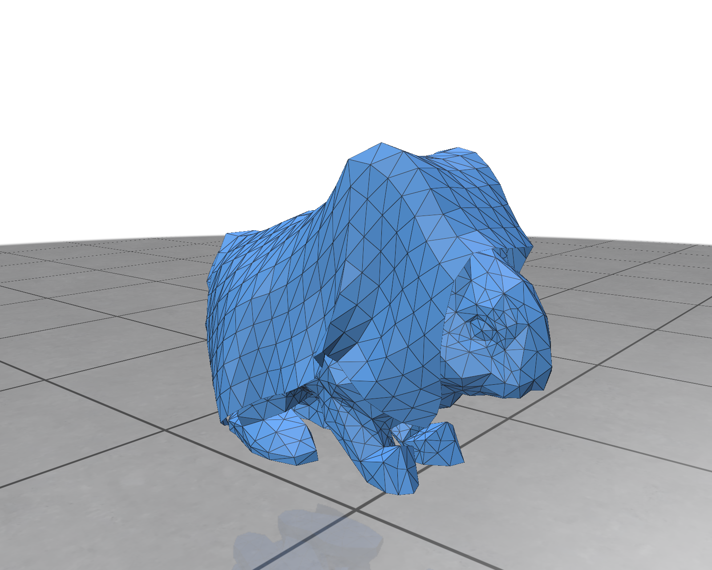

# Bunny Cloth

This is a simple cloth simulation with libuipc. 



In this example, we use `StrainLimitingBaraffWitkinShell` and
`DiscreteShellBending` to simulate the cloth. All cloth examples share this
material preset.

The `thickness` value is the one-sided radius; the shell constitutions use the
full material thickness `2r` where physical thickness is required.

```python
slbws = StrainLimitingBaraffWitkinShell()
dsb = DiscreteShellBending()
cloth_stretch = ElasticModuli2D.youngs_poisson(5e4, 0.49)
cloth_shear = ElasticModuli2D.youngs_poisson(1e1, 0.49)
slbws.apply_to(cloth_mesh,
               stretch_moduli=cloth_stretch,
               shear_moduli=cloth_shear,
               mass_density=200,
               thickness=0.001,
               strain_rate=100)
dsb.apply_to(cloth_mesh, 3e4, 0.49)
```
