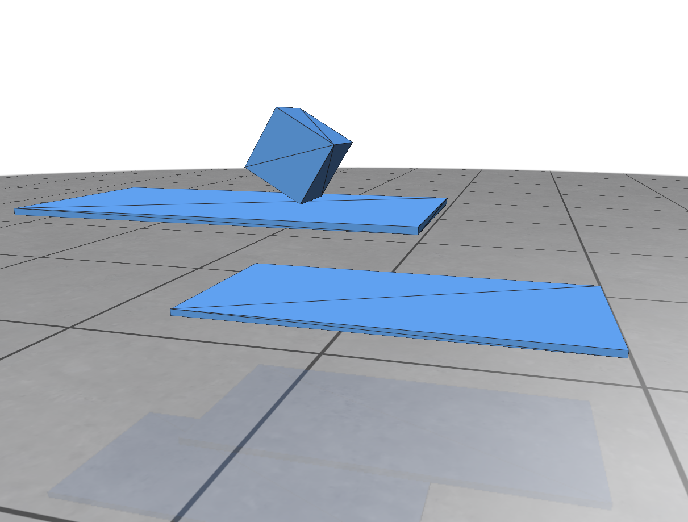
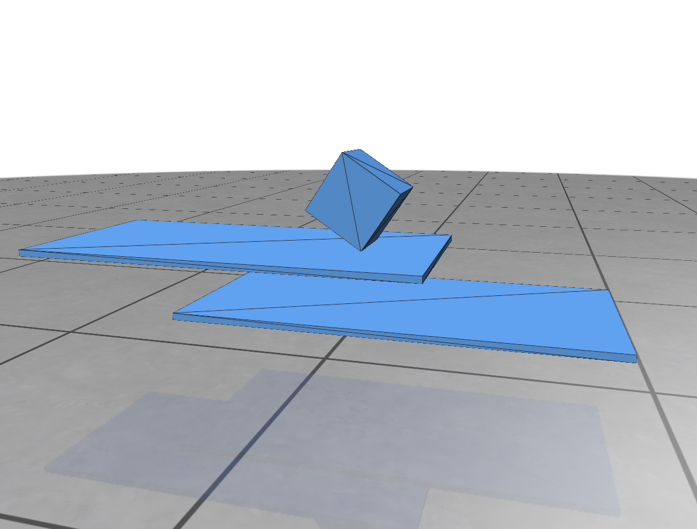
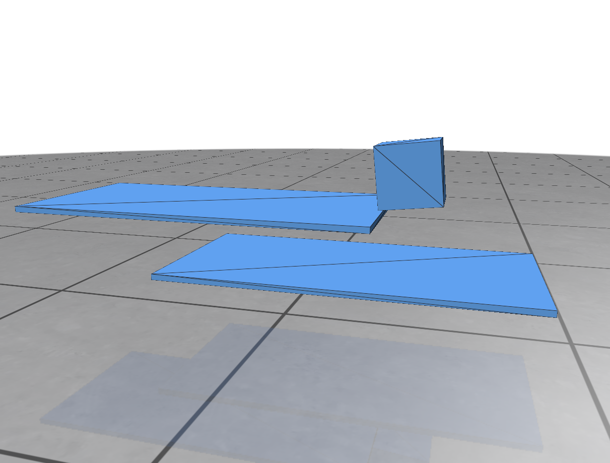
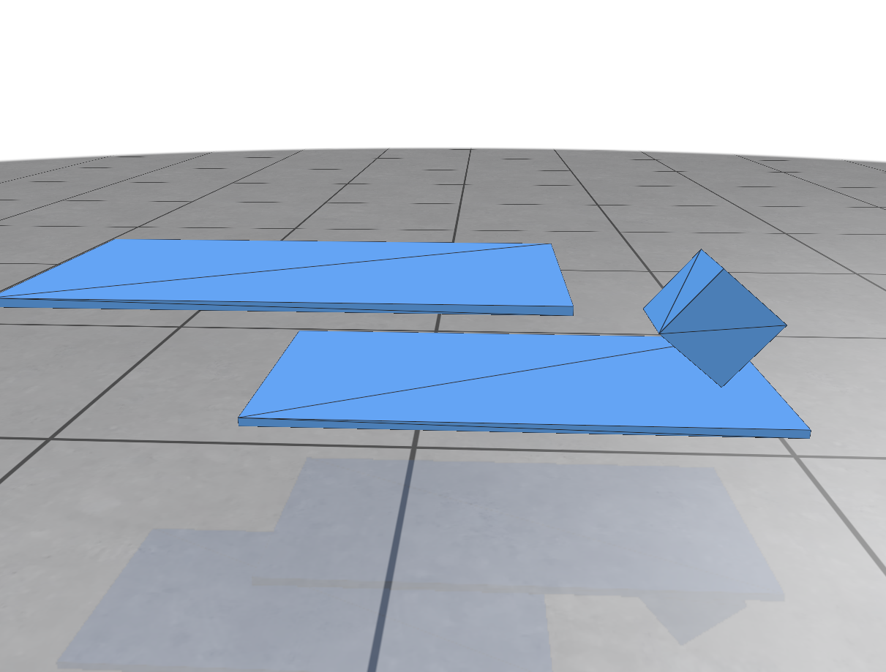

# Walking Cube Moving Board

This is a simple example of a walking cube on a moving board.

By using a `RotatingMotor` we can make the cube turn around by it's **own** x-axis, additionally, with the help of friction, we can make the cube walk.

|                   |                   |
| ----------------- | ----------------- |
|  |  |
|  |  |

The script shows the usage of `RotatingMotor` and `SoftTransformConstraint`, which can be used to constrain the movement of affine bodies.
