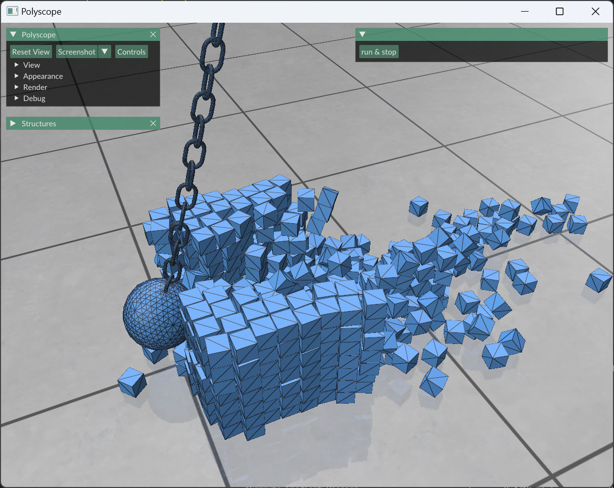

# Wrecking Ball

This is a pure affine-body multi-body contact simulation using libuipc.



Run the interactive viewer or the finite headless benchmark:

```shell
python main.py
python main.py --headless 120
```

The headless path reports full-precision per-frame timing, structured
Newton/line-search/linear-solver counts, and the final ball center. From the
libuipc repository root, prefer the canonical runner so revisions, runtime
facts, memory samples, and the raw log are archived together:

```shell
python scripts/run_benchmark.py run rigid-wrecking-balls
```

Set `UIPC_BENCHMARK_TIMERS=1` only for a separate synchronized stage-timing
diagnostic. Normal throughput runs keep it disabled.

## Q&A

Where is the `workspace`?

```python
workspace = './' # it's up to you where to put the workspace
engine = Engine('cuda', workspace)
```

For this sample, `AssetDir.output_path(__file__)` calculates the workspace under
`libuipc-samples/output/examples/6_wrecking_balls/`.
