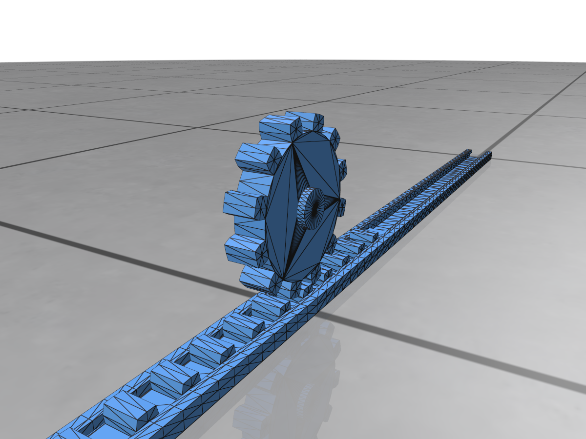
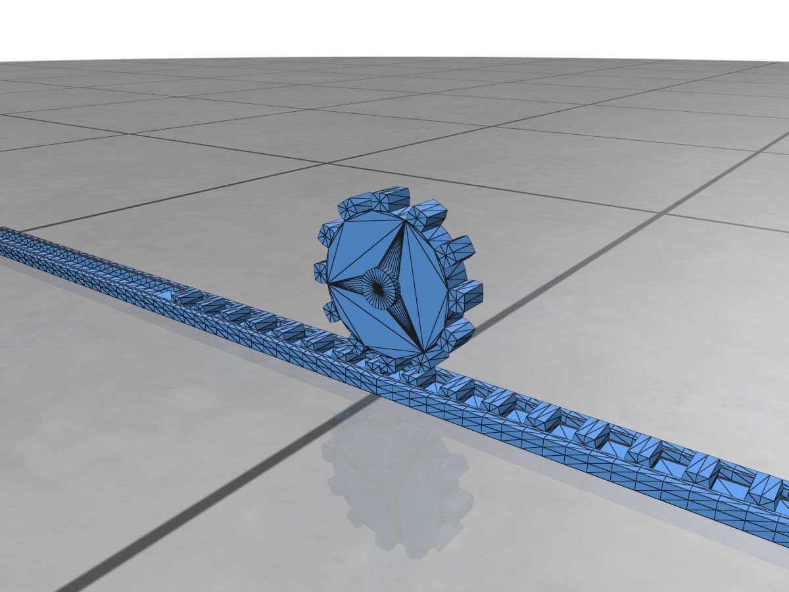
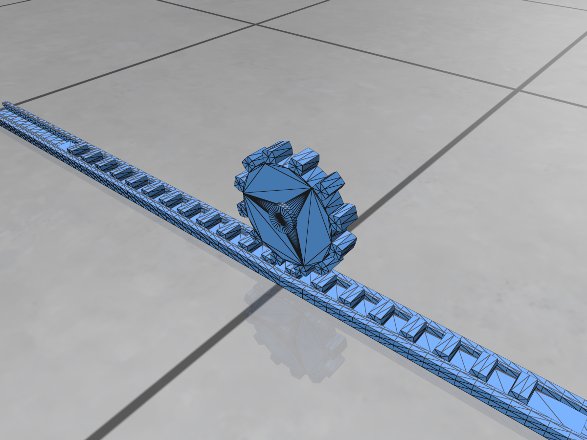
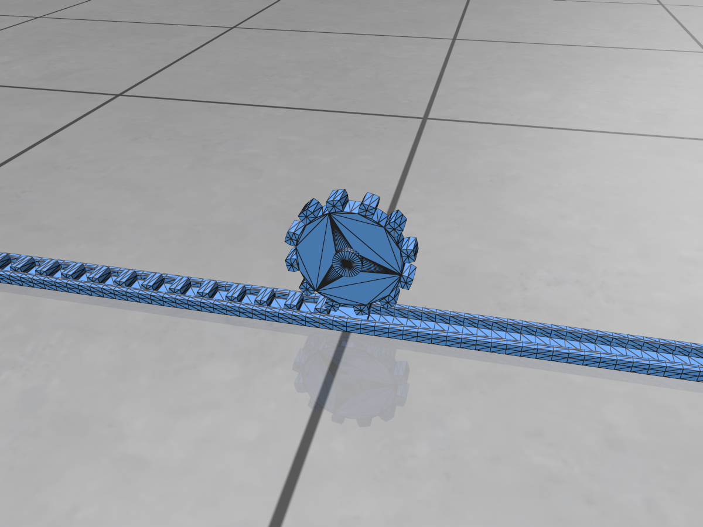

# Simple Gear

This is a simple example of a gear system.

|                   |                   |
| ----------------- | ----------------- |
|  |  |
|  |  |

The script shows the usage of `RotatingMotor` and the possibility of driving a gear system.
