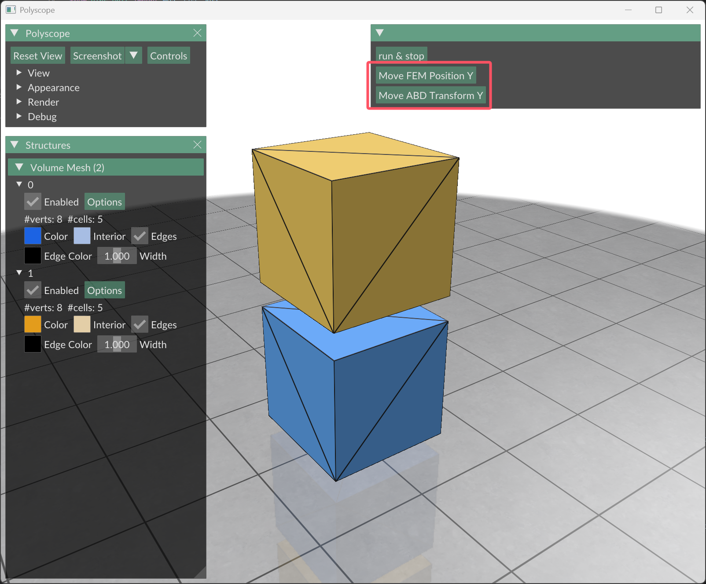

# State Accessor Feature

This example demonstrates how to use the `StateAccessorFeature` to directly manipulate the state data of finite element entities and affine bodies in the simulation.

## Summary

The `StateAccessorFeature` allows users to access and modify the internal state of simulation objects, such as positions and transformations, at runtime. This feature is useful for tasks like manual adjustments, debugging, or implementing custom behaviors，e.g. domain randomization.

## Usage

1. **Initialize the State Accessor**: After initializing the simulation world, retrieve the `AffineBodyStateAccessorFeature` and `FiniteElementStateAccessorFeature` from the world's features.
2. **Create State Geometries**: Use the accessor to create geometries that hold the state data (e.g., positions or transformations).
3. **Modify State Data**: Copy the state data from the backend, modify it, and copy it back to the backend.
4. **Update the Simulation**: Retrieve the updated state and refresh the GUI to reflect the changes.

Refer to the `main.py` script for a detailed implementation.

Note that, if the manual modifications may lead to invalid states (e.g., penetrations), user should perform sanity checks and recover the last valid state if necessary.

For more insights and updates, please visit the discussion thread: https://github.com/spiriMirror/libuipc/discussions/232